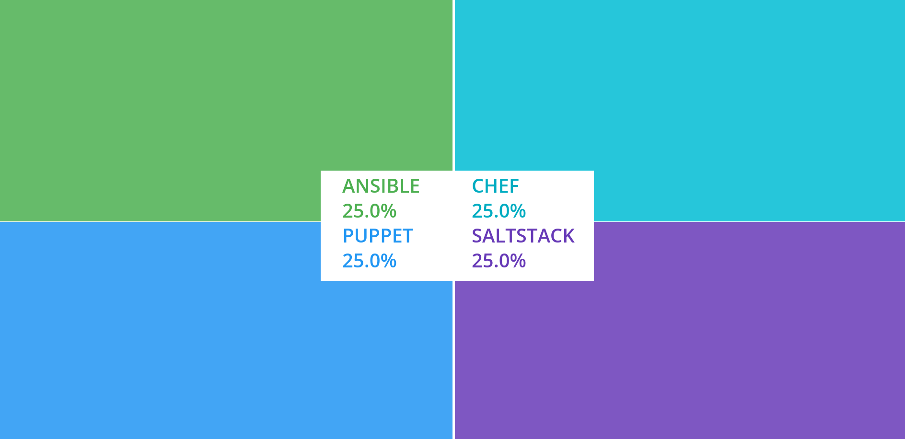
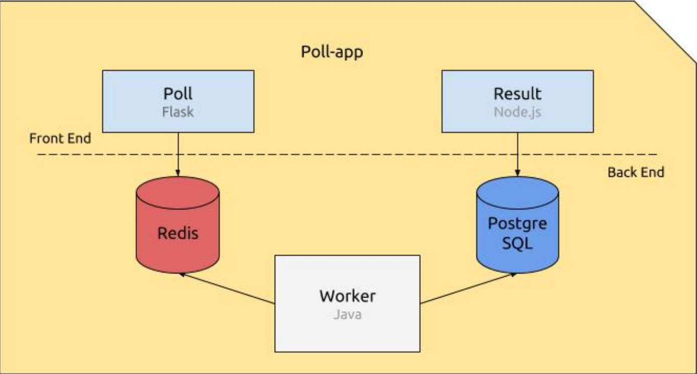

# popeye



<!-- ABOUT THE PROJECT -->
## About The Project
The goal of this project is to containerize and define the deployment of a simple web poll application

There are five elements constituting the application, connected in a container :

- **Poll**, a flask Python web application that gathers votes and push them into a `Redis` queue.

- **Redis**, which holds the votes sent by the Poll application, awaiting for them to be consumed by the `Worker`.

- **Worker**, a java application which consumes the votes being in the Redis queue, and stores them into a `PostgreSQL` database

- **PostgreSQL database**, which (persistently) stores the votes stored by the Worker.

- **Result**, a Node.js web application that fetches the votes from the database and displays the. . . well, result.



<!-- REQUIREMENTS -->
## Requirements
* Docker
* Docker Compose

<!-- GETTING STARTED -->
## Getting Started

Check that Docker is installed on your computer and let's start !
Clone the repositorie and build images with Docker-compose
```sh
docker-compose up --build
```
you can see the Poll on `localhost:5000/` and the Result on `localhost:5001/`

Do not forget to down containers
```sh
docker-compose down -v
```
